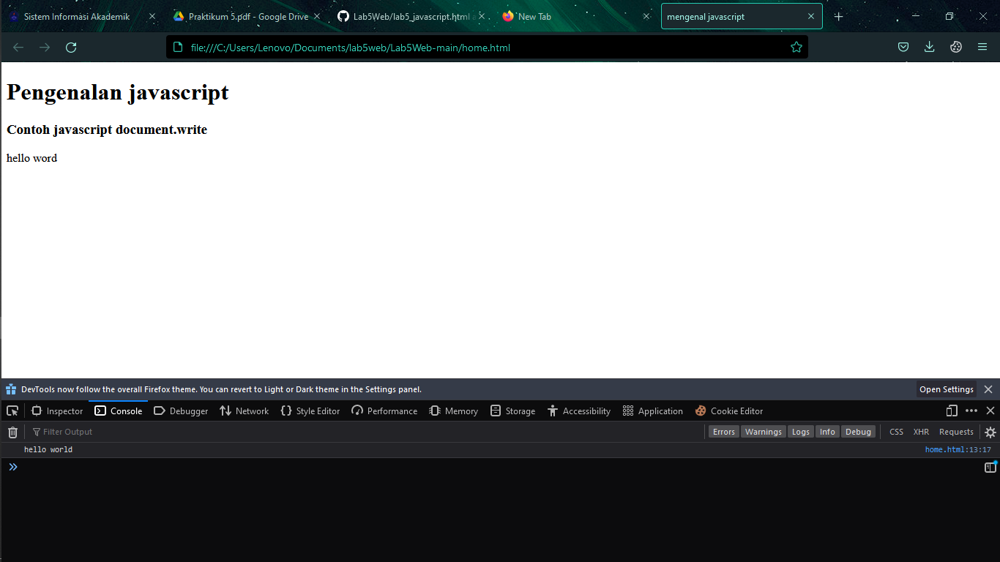
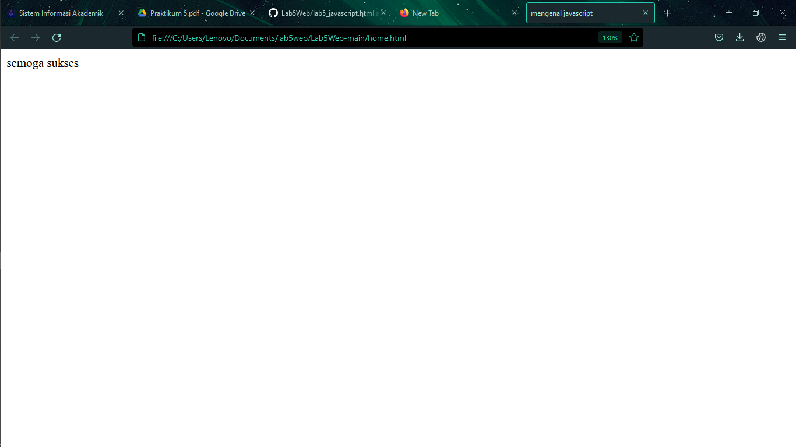
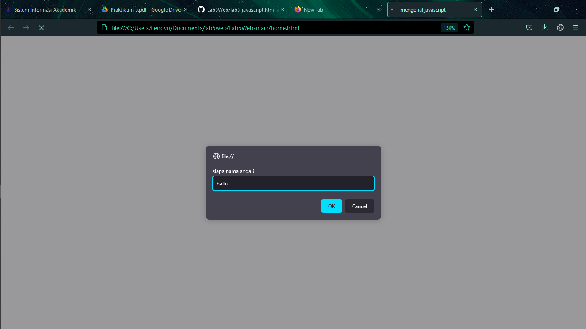
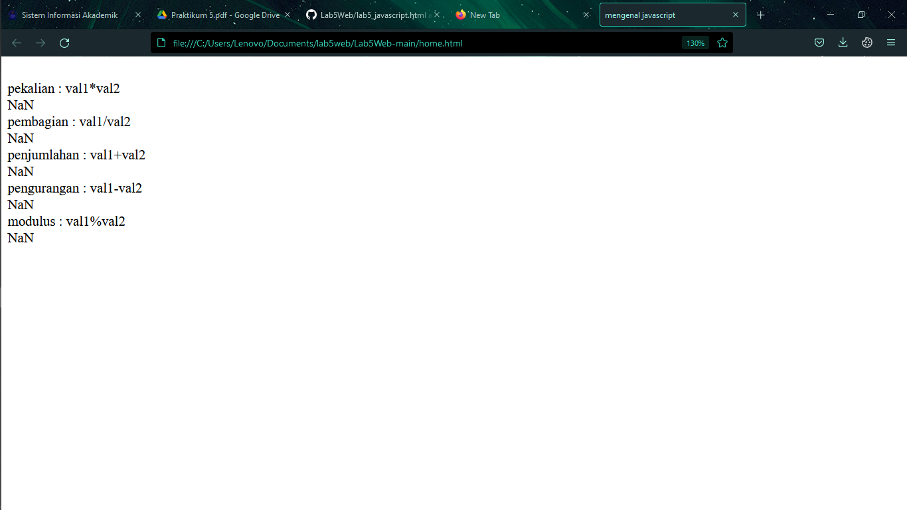
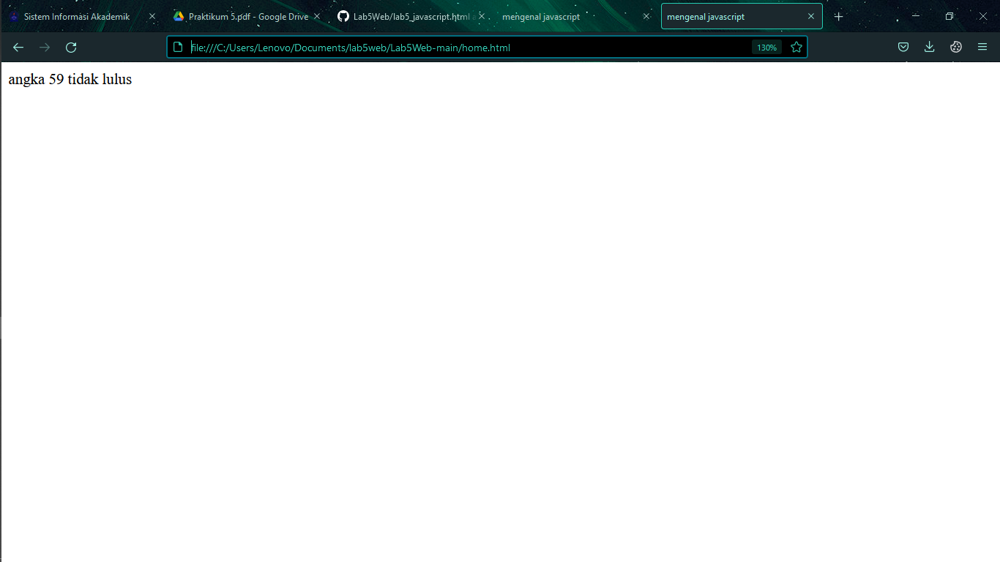
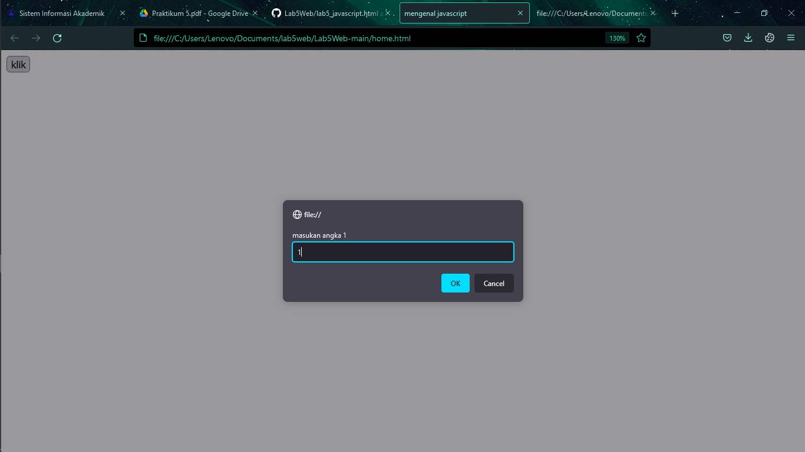
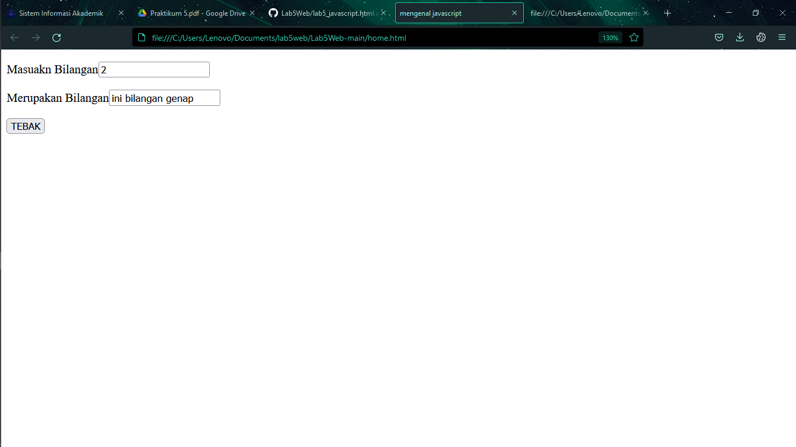
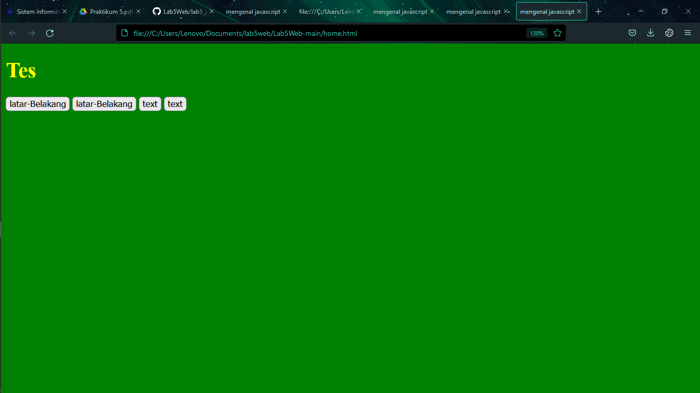
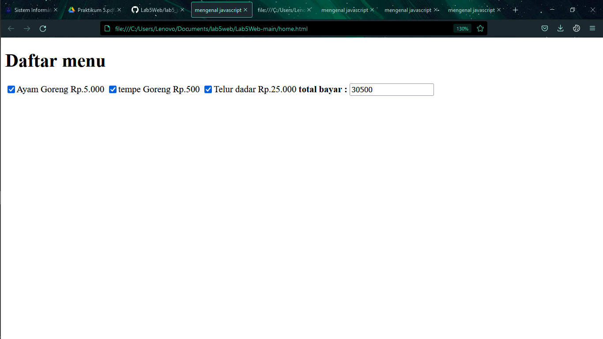

# Tugas LAB 3 Web
## Profil
| # | Biodata |
| -------- | --- |
| *Nama* | Muhammad rizky abdillah |
| *NIM* | 312010368 |
| *Kelas* | TI.20.A.2 |
| *Mata Kuliah* | Pemrograman Web |

## 1. Langkah Langkah Praktikum
* Contoh penggunaan javascript pada tag head

```
<!DOCTYPE html>
<html lang="en">
<head>
    <meta charset="UTF-8">
    <meta name="viewport" content="width=device-width, initial-scale=1.0">
    <script type="javascript">
        alert("javascript pada tag head");
    </script>
</head>
<body>
</body>
</html>
```

* Contoh penggunaan javascript pada tag head
```
<!DOCTYPE html>
<html lang="en">
<head>
    <meta charset="UTF-8">
    <meta name="viewport" content="width=device-width, initial-scale=1.0">
</head>
<body>
 <script>
        alert("javascript pada tag head");
    </script>
</body>
</html>
```

* Contoh penggunaan javascript eksternal
```
<head>
<script src="javascript.js"></script>
</head>
```
* file javasciprt.js
```
document.write("Hello World")
```

## Langkah praktikum
* Persiapan membuat dokumen HTML dengan nama file lab5_javascript.html seperti berikut.
```
<!DOCTYPE html>
<html lang="en">
<head>
    <meta charset="UTF-8">
    <meta name="viewport" content="width=device-width, initial-scale=1.0">
    <title>mengenal javascript</title>
</head>
<body>
    <h1>Pengenalan javascript</h1>
    <h3>Contoh javascript document.write</h3>
    <script>
        document.write("hello word");
        console.log("hello world");
    </script>
</body>
</html>
```
* kemudian hasilnya adalah


## Javascript dasar
* pemakaian alert pada windows
```
<!DOCTYPE html>
<html lang="en">
<head>
    <meta charset="UTF-8">
    <meta name="viewport" content="width=device-width, initial-scale=1.0">
    <title>mengenal javascript</title>
</head>
<body>
    <script>
        window.alert("hello word");
    </script>
</body>
</html>
```
* pemakaian menggunakan objek
```
<!DOCTYPE html>
<html lang="en">
<head>
    <meta charset="UTF-8">
    <meta name="viewport" content="width=device-width, initial-scale=1.0">
    <title>mengenal javascript</title>
</head>
<body>
    <script>
        window.alert("hello word");
        document.write("semoga sukses");
    </script>
</body>
</html>
```
* maka hasilnya adalah


* Pemakaian Prompt
```
<script>
    var nama = prompt ("siapa nama anda ?", "masukan nama anda");
    document.write("hai" + nama);
</script>
```
* Pembuatan Fungsi cara pemanggilannya

```
<script>
    function pesan(){
        alert ("memanggil javascript lewat body onload");
    }
</script>
<body onload=pesan()>
```
* maka hasilnya adalah


## Penggunaan dasar dari aritmatika javascript

```
<body>
<script>
    function test (val1,val2)
    {
    document.write("<br>" + pekalian : val1*val2 "+"<br>")
    document.write(val1*val2)
    document.write("<br>" + pembagian : val1/val2 "+"<br>")
    document.write(val1*val2)
    document.write("<br>" + penjumlahan : val1+val2 "+"<br>")
    document.write(val1*val2)
    document.write("<br>" + pengurangan : val1-val2 "+"<br>")
    document.write(val1*val2)
    document.write("<br>" + modulus : val1%val2 "+"<br>")
    document.write(val1*val2)
    }
</script>
 <input type="button" value="artimatika" onclick=test()>
</body>
```
* maka hasilnya adalah


* melakukan kondisi meggunakan if else
```
<script>
var nilai = prompt ("nilai 0 - 100  ", 0);
var hasil = " ";
if (nilai >= 60)
hasil = "lulus";
else
hasil = "tidak lulus"
document.write("hasil: " + hasil);
</script>
```
* maka hasilnya adalah yang dimana jika nilai lebih besar dari pada >= 60 maka 
akan mengluarkan hasil true yaitu lulus dan jika dimana nilai lebih kecil dari 60 
maka nilai akan bersifat false yaitu tidak lulus


* Penggunaan operator switch 
```
<body>
    <script>
        function test(){
            val1 = window.prompt("masukan angka 1")
            switch(val1){
                case "1" : 
                document.write("ini angka 1")
                break
                case "2" : 
                document.write("ini angka 2")
                break
                case "3" : 
                document.write("ini angka 3")
                break
                case "4" : 
                document.write("ini angka 4")
                break
                case "5" : 
                document.write("ini angka 5")
                break
                
            }
        }
    </script>
    <input type="button" value="klik" onclick=test()>
</body>
```


* Membuat program form input 
```
<body>
    <script>
        function test(){
            var val1=document.kirim.T1.value
            if( val1%2==0)
                document.kirim.T2.value="ini bilangan genap"
            else 
                document.kirim.T2.value="ini bilangan ganjil"
        }
    </script>
    <form method="POST" name="kirim">
        <p>Masuakn Bilangan<input type="text" name="T1"></p>
        <p>Merupakan Bilangan<input type="text" name="T2"></p>
        <p><input type="button" value="TEBAK" name="B1" onclick=test()></p>
    </form>
</body>
```
* maka hasilnya


* Form Button membuat program merubah background warna
```
<body>
    <script>
        function ubahwarna(warna){
            document.bgColor=warna;
        }
        function ubahwarnatx(warna){
            document.fgColor=warna;
        }
    </script>
    <h1>Tes</h1>
    <form action="#">
        <input type="button" value="latar-Belakang" onclick="ubahwarna('GREEN')">
        <input type="button" value="latar-Belakang" onclick="ubahwarna('yellow')">
        <input type="button" value="text" onclick="ubahwarnatx('GREEN')">
        <input type="button" value="text" onclick="ubahwarnatx('yellow')">
    </form>
</body>
```
* maka hasilnya


* Modul Praktikum 
* HTML DOM Pilihan menggunakan checkBox dengan perhitungan otomatis
```
<body>
    <script>
        function hitung(ele){
            var total = document.getElementById('total').value;
                total = (total ?  parseInt(total) : 0);
            var harga = 0;

            if (ele.checked){
                harga = ele.value;
                total += parseInt(harga);
            }else{
                harga = ele.value;
                if (total > 0)
                total -= parseInt (harga);
        }
        document.getElementById('total'). value = total;
    }
    </script>
    <h1>Daftar menu</h1>
    <label><input type="checkbox" value="5000" id="menu" onclick="hitung(this);">Ayam Goreng Rp.5.000</label>
    <label><input type="checkbox" value="500" id="menu" onclick="hitung(this);">tempe Goreng Rp.500</label>
    <label><input type="checkbox" value="25000" id="menu" onclick="hitung(this);">Telur dadar Rp.25.000</label>
    <strong>total bayar : <input id="total" type="text"></strong>
</body>
```
* maka hasilnya adalah


## Terima Kasih


